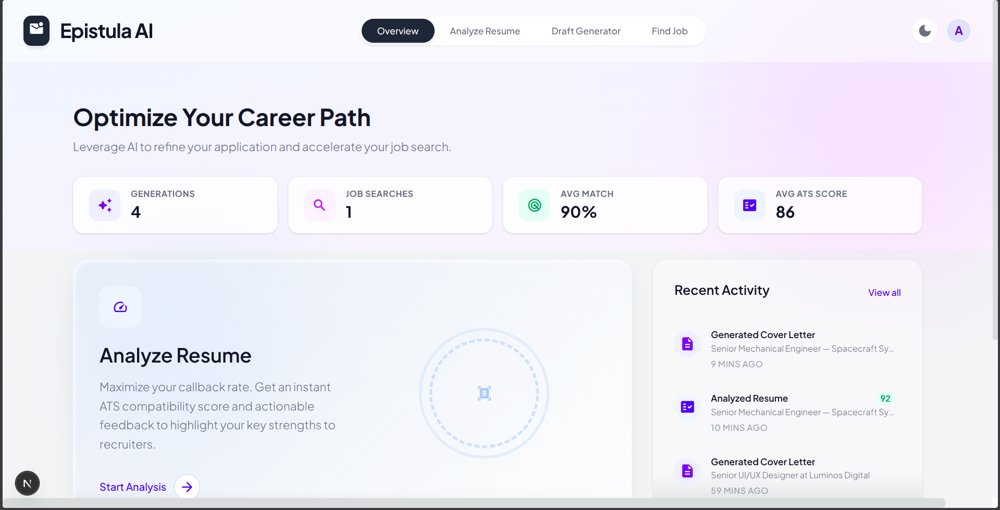
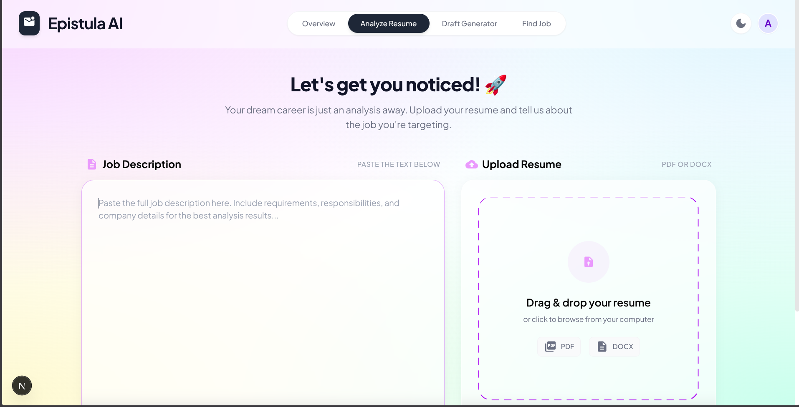
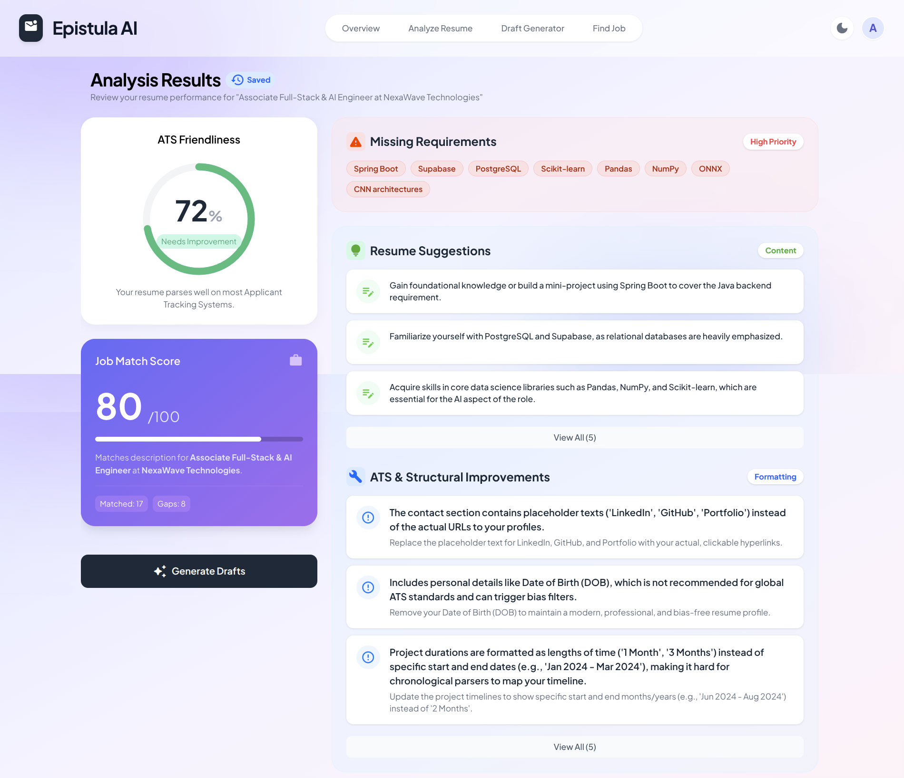
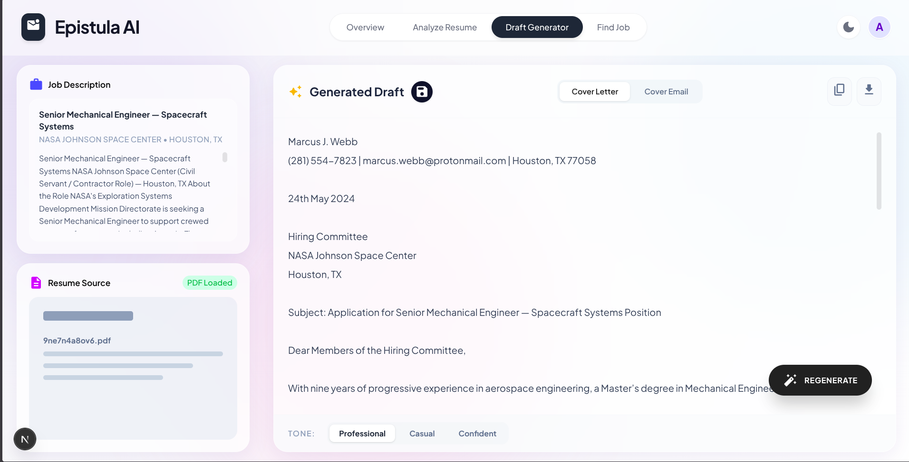
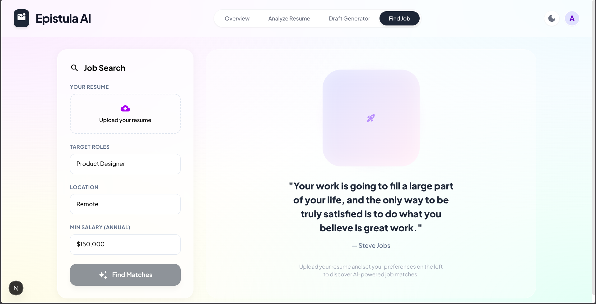

# Epistula AI 🚀

Epistula AI is a powerful, AI-driven career path optimization platform designed to accelerate your job search. By leveraging advanced AI, Epistula helps you refine your applications, analyze your resume against job descriptions, and auto-generate compelling cover letters.

## 🌟 Features

- **Resume ATS Analysis**: Get an instant ATS (Applicant Tracking System) compatibility score and actionable feedback to highlight your key strengths to recruiters.
- **Smart Cover Letter Generation**: Auto-draft highly customized and compelling narratives tailored specifically to any job description.
- **AI-Powered Job Matching**: Uncover hidden opportunities. Let AI match your unique profile with high-potential roles.
- **Interactive Dashboard**: Track your job search progress, recent generations, average ATS scores, and overall match percentages.

## 🛠️ Tools & Frameworks

**Frontend:**
- **[Next.js](https://nextjs.org/)**: React framework for server-side rendering and static site generation.
- **[Tailwind CSS](https://tailwindcss.com/)**: Utility-first CSS framework for rapid and modern UI development.
- **[React](https://reactjs.org/)**: A JavaScript library for building user interfaces.
- **[Supabase](https://supabase.com/)**: Open-source Firebase alternative used for Authentication and PostgreSQL Database.

**Backend (Separate Repository):**
- **[FastAPI](https://fastapi.tiangolo.com/)**: High-performance Python web framework for building the AI orchestration APIs.
- **[Uvicorn](https://www.uvicorn.org/)**: ASGI web server implementation for Python.
- **[LangChain](https://python.langchain.com/docs/)**: Framework for building AI applications.


## 📸 Screenshots

### 1. Dashboard
Your command center for tracking recent activity and overall job search statistics.


### 2. Analyze Resume
Upload your resume and a job description to get started.


### 3. Analysis Result
Detailed breakdown of your ATS score, matched skills, and actionable feedback.


### 4. Cover Letter Generation
AI-generated, fully tailored cover letter ready to be downloaded or copied.


### 5. Job Search
Discover and match with open roles that fit your skill profile.


## 🚀 Running the Project Locally

### Prerequisites
- Node.js (v18 or higher)
- npm or yarn
- Python 3.10+ (for the backend service)
- A Supabase account for the database/auth

### Frontend Setup
1. **Clone the repository** (if you haven't already):
   ```bash
   git clone <your-repo-url>
   cd epistula
   ```

2. **Install dependencies**:
   ```bash
   npm install
   # or
   yarn install
   ```

3. **Set up environment variables**:
   Create a `.env.local` file in the root directory and add your Supabase credentials:
   ```env
   NEXT_PUBLIC_SUPABASE_URL=your_supabase_url
   NEXT_PUBLIC_SUPABASE_ANON_KEY=your_supabase_anon_key
   ```

4. **Run the development server**:
   ```bash
   npm run dev
   # or
   yarn dev
   ```
   Open [http://localhost:3000](http://localhost:3000) with your browser to see the result.

### Backend Setup
Make sure the backend is running concurrently to utilize the AI features:
1. Navigate to the `epistula-backend` directory.
2. Install dependencies (e.g., `uv pip install -r requirements.txt`).
3. Run the API:
   ```bash
   uv run uvicorn main:app --reload
   ```

## 🔮 Future Roadmap

- [ ] **Export to PDF/DOCX**: Native download capabilities for generated resumes and cover letters with professional formatting.
- [ ] **External Job Board Integrations**: Direct application capabilities via API integrations with LinkedIn, Indeed, etc.
- [ ] **Customizable Templates**: Allow users to choose from various cover letter and resume design templates.
- [ ] **Chrome Extension**: Analyze job descriptions and auto-draft letters directly from job board websites.
